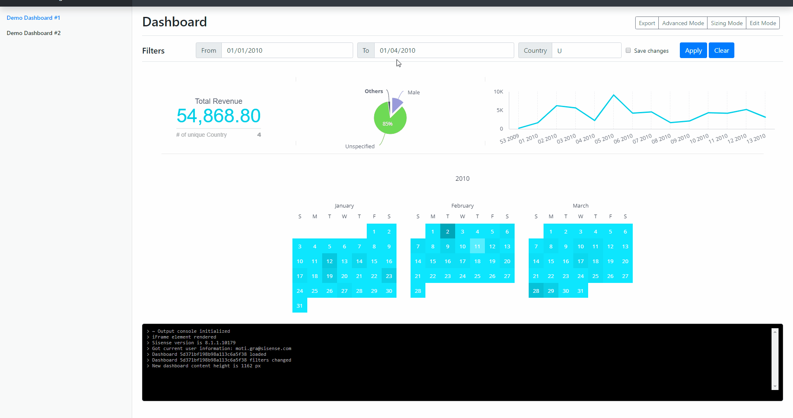

# Sisense Embed SDK Demo

This project is a demo of Sisense's Embed SDK - a Javascript library used to embed Sisense dashboards into other web pages in an interactive manner, available in Sisense V8.1 and up.

> *Note: this demo utilizes some features available only with Sisense V8.1.1 and higher*

The repository includes all the assets (such as an Elasticube and dashboards) required to set up this demo. Below you will find instructions for set up, customization and contributions.

For more information about the Sisense Embed SDK, please visit the [Sisense Embed SDK documentation](https://developer.sisense.com/display/API2/Embed+SDK)

#### Table of Contents

Within this document:
 - [Setting up this demo](#setting-up-this-demo)
 - [Using this demo](#using-this-demo)

External documents:
 - [License](LICENSE)
 - [Contribution guidelines](CONTRIBUTING.md)



<!--

TODO LIST
=========

 - screenshots & gifs
 - code review

-->

## Setting up this demo

> Make sure you have met the following prerequisites prior to starting:
>  - [Installed `Sisense V8.1.1`](https://documentation.sisense.com/latest/getting-started/download-install.htm) on your server and activated it
>  - [Set up CORS](https://documentation.sisense.com/latest/content/cors.htm)
>  - [Set up SSO](https://documentation.sisense.com/latest/administration/user-management/single-sign-on/introduction-sso.htm) (Optional - you can manually log in to Sisense in another tab to create a cookie)
>  - Have [NodeJS](https://nodejs.org/en/) and [NPM](https://www.npmjs.com/) installed and up-to-date

1. Clone or download this repository
1. The demo uses one of the sample Datamodels included with Sisense called "Sample ECommerce".  
If you don't already have this Datamodel, Import the Elasticube file (`.ecdata`) included in the `assets` folder to your Sisense server
1. Import the Dashboard files (`.dash`) included in the `assets` folder to your Sisense server
1. Open the `index.html` file using any text editor and:
   1. Locate the line `<!-- Get iFrame SDK -->`
	1. Beneath it, update the URL in the `script` tag to match your Sisense server's IP/host and port: `<script src="http://localhost:8081/js/frame.js"></script>`
1. Open the `config.js` file using any text editor or IDE and:
   1. Update the `baseUrl` property to match your Sisense server's IP/host and port
   1. Update the `dashboards` array with the OIDs of your imported dashboards
1. Run `npm install`
1. Run `npm start` to start a local dev server, which will automatically open the demo in your browser.  
   _If a tab doesn't open automatically, navigate to http://localhost:8887/index.html_

## Using this demo

This project utilizes very few files and dependencies to keep things simple.

Below you can find a description of dependencies, project structure, and other info to help you understand this demo and customize it for your needs.

**Dependencies**

All of the dependencies below are used by the demo page itself **and are not required to use the Sisense Embed SDK**.

| Name | Type | Source | Version | Description |
|------|------|--------|---------|-------------|
| [Bootstrap](https://getbootstrap.com/) | CSS | CDN | 4.4.1 | Bootstrap CSS framework used for the demo's UX design |
| [http-server](https://www.npmjs.com/package/http-server) | NodeJS | NPM | ^0.11.1 | Lightweight NodeJS-based HTTP server for static files |

This project's UI was based on, but does not depend on, the [Bootstrap 4.4 Dashboard Example](https://getbootstrap.com/docs/4.4/examples/dashboard/)

**File Structure**

```
./
├── readme.md                    --> This README file
├── LICENSE                      --> License info
├── CONTRIBUTING.md              --> Contribution guidelines
├── package.json                 --> NPM
├── index.html                   --> Main demo page
├── assets/                      -->
│   ├── demo-dash-1.dash         --> Sample Dashboard
│   ├── demo-dash-2.dash         --> Sample Dashboard
│   └── Sample ECommerce.ecdata  --> Sample Elasticube
├── images/                      -->
│   └── main.gif                 --> GIF image used in this document
├── css/                         -->
│   └── main.css                 --> Custom CSS (in addition to Bootstrap)
└── js/                          -->
    ├── array-find.poly.js       --> Polyfill of Array.prototype.find() for older browsers
    ├── config.js                --> Demo configuration
    ├── index.js                 --> Demo code
    └── log.js                   --> Faux console utility
```